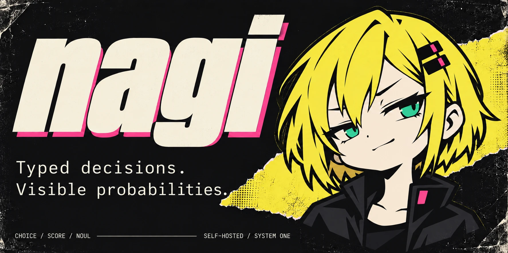
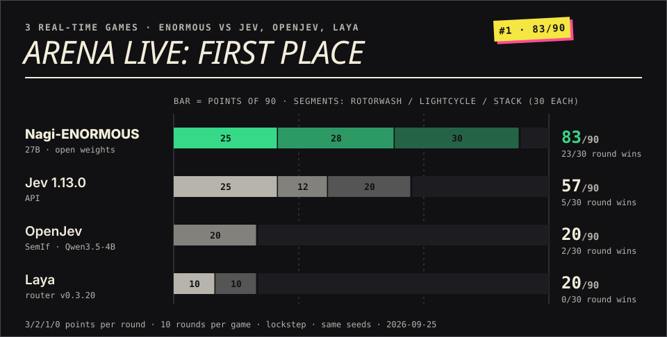
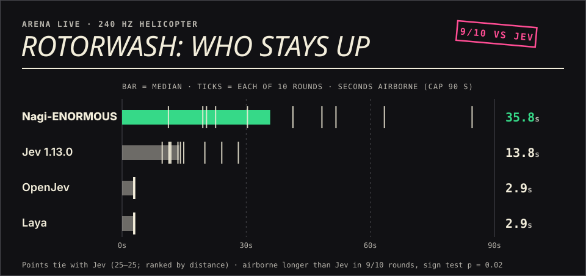
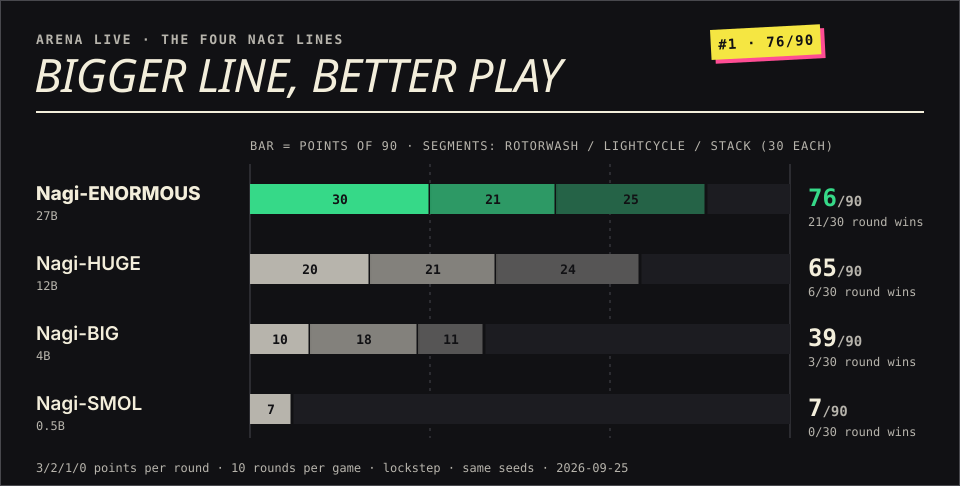
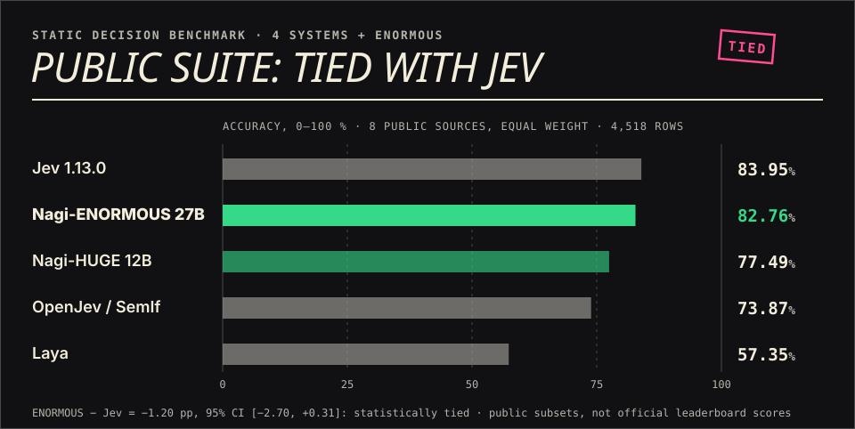

# Nagi



**Typed decisions in one forward pass.** Nagi takes a state and a closed set of options and returns a choice with a probability distribution. Four open model lines: SMOL 0.5B · BIG 4B · HUGE 12B · ENORMOUS 27B.

[**Watch Arena Live →**](https://nagisanzenin.github.io/nagi/arena-live/) · [All replays](https://nagisanzenin.github.io/nagi/arena/) · [Models on Hugging Face](https://huggingface.co/nagisanzeninz) · [Full benchmarks](docs/BENCHMARKS.md)

## Arena Live

Three real-time games: a 240 Hz helicopter, four-player Tron and a Tetris battle. 10 rounds each, the same seeds for every model, lockstep play (latency is shown, not scored).







An exhibition, not a universal ranking. It measures skill under known rules; on reading brand-new rules, 27B does not yet beat 12B. [Per-game tables](bench/arena_live) · [Interactive page](https://nagisanzenin.github.io/nagi/arena-live/)

## Public suite



[Per-source results, latency and method](docs/BENCHMARKS.md#public-benchmark--four-systems-inspectable-evidence)

## Install

```bash
python -m pip install "nagi-decisions @ git+https://github.com/nagisanzenin/nagi.git"
```

Python 3.10+. The import is `nagi` (the unrelated PyPI package `nagi` is not this project). Weights download from Hugging Face on first load.

```python
from nagi import load_smol          # CPU; load_big / load_huge / load_enormous need a GPU

nagi = load_smol(device="cpu")
out = nagi.system_one(state={"message": "Please cancel my subscription."}, questions={
    "route": {
        "type": "choice",
        "instructions": "Select the team that should handle the request.",
        "criteria": {"billing": "Subscriptions and payments", "technical": "Technical issues"},
    }
})
print(out["answers"]["route"])  # {"choice": ..., "probabilities": {...}, "confidence": ...}
```

| Line | Loader | Base | Runs on |
|---|---|---|---|
| [SMOL 0.5B](https://huggingface.co/nagisanzeninz/nagi-smol-v0) | `load_smol()` | ModernBERT-large | CPU |
| [BIG 4B](https://huggingface.co/nagisanzeninz/nagi-big-v3) | `load_big()` | Qwen3.5-4B | GPU, BF16 |
| [HUGE 12B](https://huggingface.co/nagisanzeninz/Nagi-HUGE) | `load_huge()` | Gemma4 12B + adapter | H100 BF16 (~24 GB params) |
| [ENORMOUS 27B](https://huggingface.co/nagisanzeninz/Nagi-ENORMOUS) | `load_enormous()` | Qwen3.8-27B + adapter | 80 GB GPU, BF16 |

Question types: `choice` (pick a label), `score` (ordered levels), `noul` (probability of true). 2–26 options per question; context limits differ per line ([details](docs/CONTEXT.md)). Probabilities are conditional on the options you supply, not guarantees.

[Install guide](docs/INSTALL.md) · [Recipes](docs/RECIPES.md) · [Calibration](docs/CALIBRATION.md) · [ENORMOUS release](docs/ENORMOUS_RELEASE.md) · [HUGE release](docs/HUGE_RELEASE.md) · [Brand](docs/brand/brand-guideline.md)
